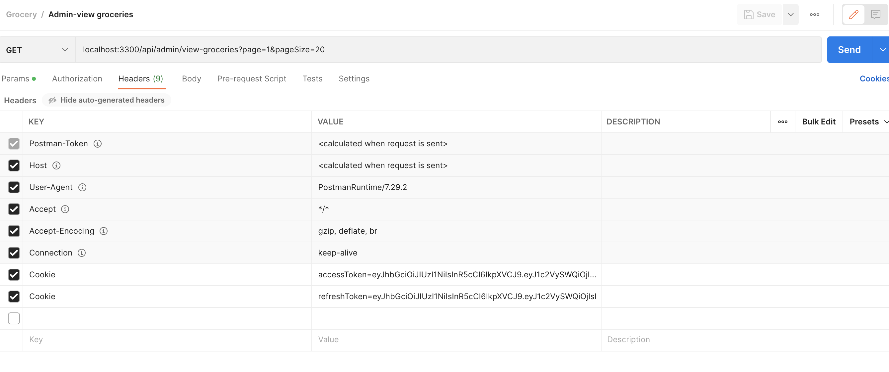

# Grocery Store

**Grocery App with user roles, inventory management, basic CRUD operations cart management and  order management.**

## Table of Contents
- [Grocery Store](#grocery-store)
  - [Table of Contents](#table-of-contents)
  - [Features](#features)
  - [Prerequisites](#prerequisites)
  - [Getting Started](#getting-started)
    - [Method 1: Docker](#method-1-docker)
    - [Method 2: Local Development](#method-2-local-development)
  - [API Endpoints](#api-endpoints)
    - [Admin Operations](#admin-operations)
    - [User Operations](#user-operations)
  - [Folder Structure](#folder-structure)
  - [Project Dependencies](#project-dependencies)
    - [Development Dependencies](#development-dependencies)
    - [Dependencies](#dependencies)
  - [Project Info](#project-info)
    - [Author](#author)
    - [License](#license)
    - [Doubt](#doubt)
---

## Features

- **User Authentication:**  Admins and Users can sign up and log.
- **CRUD Operations:** Admin users can create, read, update, and delete grocery items.
- **Inventory Tracking:** Admins can manage inventory levels for each grocery item.
- **View Groceries:**: Users can view available grocery items.
- **Cart Management:** Users can add items to the cart.
- **Order Management:** Users can place orders.

> Can refer to postman collection at this location : ``./Grocery.postman_collection.json``

---

## Prerequisites

Make sure you have the following installed:
- [Docker](https://www.docker.com/)

OR with Local Development:

- [Node.js](https://nodejs.org/)
- [npm](https://www.npmjs.com/)

Ensure you have a PostgreSQL database available for the application.

---

## Getting Started

To get started with the Grocery Store, follow these steps:

### Method 1: Docker

1. Clone the Repository: `https://github.com/akhilnayak0206/qp-assessment.git`
3. Set Up Environment Variables: Copy `.env.docker.example` to `.env` and configure your PostgreSQL database credentials.
4. Run Docker: Run `docker-compose up --build` to start the application in Docker.
5. Run Migrations: Execute `docker-compose run app npm run migration` to run migrations.

### Method 2: Local Development

1. Clone the Repository: `https://github.com/akhilnayak0206/qp-assessment.git`
2. Move to app folder: `cd app`
3. Install Dependencies: Run `npm install` to install all required dependencies.
4. Set Up Environment Variables: Copy `.env.app.example` to `.env` and configure your PostgreSQL database credentials.
5. Run Migrations: Run `npm run migration` to create the necessary models.
6. Start the Application: Run `npm run dev` to start the dev env of Node.js server. It tracks the live changes.

---
> Info: To check if apis are running, run `localhost:3300/api/` and check if you get the output as "Welcome"
---
> Once the apis are running please create a user and then run the login api. 
> 
> Post that copy access token and refresh token and paste it in the headers Cookie within Postman.
> 

---

## API Endpoints

### Admin Operations

| Endpoint                                | Description                                       |
| --------------------------------------- | ------------------------------------------------- |
| `POST /api/register`                     | Admin user registration                           |
| `POST /api/login`                        | Admin user login                                  |
| `GET /api/admin/view-groceries`          | View existing grocery items (Admin)               |
| `POST /api/admin/add-grocery`            | Add new grocery items (Admin)                     |
| `DELETE /api/admin/remove-grocery/:id`   | Remove grocery items (Admin)                      |
| `PUT /api/admin/update-grocery/:id`      | Update details of existing grocery items (Admin) |
| `PUT /api/admin/manage-inventory/:id`    | Manage inventory levels of grocery items (Admin)  |

### User Operations

| Endpoint                            | Description                                       |
| ----------------------------------- | ------------------------------------------------- |
| `POST /api/register`                | User registration                                 |
| `POST /api/login`                   | User login                                        |
| `GET /api/view-groceries`           | View available grocery items (User/Admin)               |
| `POST /api/add-to-cart`             | Add grocery items to the cart (User/Admin)              |
| `POST /api/create-order`            | Create an order with items from the cart (User/Admin)   |

---

## Folder Structure

The project follows a typical MVC (Model-View-Controller) architecture:

- `database/config`: Contains Sequelize connection to DB.
- `database/migration`: Contains Sequelize scripts to create tables.
- `database/models`: Contains Sequelize model definitions for tables.
- `middleware`: Currently contains auth logic for token.
- `controllers`: Contains logic for processing HTTP req and res.
- `validators`: Validates req.
- `routes`: Defines API routes for handling HTTP requests.

---

## Project Dependencies

### Development Dependencies

- **eslint** (`^8.56.0`): A JavaScript linter tool that helps maintain code quality.
- **prettier** (`^3.2.4`): An opinionated code formatter that ensures consistent code styling.

### Dependencies

- **bcrypt** (`^5.1.1`): A library for hashing passwords securely.
- **cookie-parser** (`^1.4.6`): A middleware for parsing cookies in Express.js.
- **cors** (`^2.8.5`): A middleware for enabling Cross-Origin Resource Sharing in Express.js.
- **dotenv** (`^16.4.1`): A zero-dependency module that loads environment variables from a .env file.
- **express** (`^4.18.2`): A web application framework for Node.js.
- **express-validator** (`^7.0.1`): A set of Express.js middlewares that wraps validator.js validator and sanitizer functions.
- **helmet** (`^7.1.0`): A middleware to secure Express.js applications by setting various HTTP headers.
- **jsonwebtoken** (`^9.0.2`): A library for generating and verifying JSON Web Tokens (JWT).
- **nodemon** (`^3.0.3`): A utility that monitors for changes in files and automatically restarts the server.
- **pg** (`^8.11.3`): A PostgreSQL client for Node.js.
- **pg-hstore** (`^2.3.4`): A module for serializing and deserializing JSON data to hstore format.
- **sequelize** (`^6.36.0`): A promise-based Node.js ORM for PostgreSQL, MySQL, SQLite, and MSSQL.
- **sequelize-cli** (`^6.6.2`): Command-line interface for Sequelize migrations.
  
---
## Project Info

> Application ID : 29403799

### Author

> Akhil Nayak

### License

> This project is licensed under the [MIT](https://choosealicense.com/licenses/mit/) License.

### Doubt

> If you have any suggestion or doubt do let me know

> ThankYou.Peace